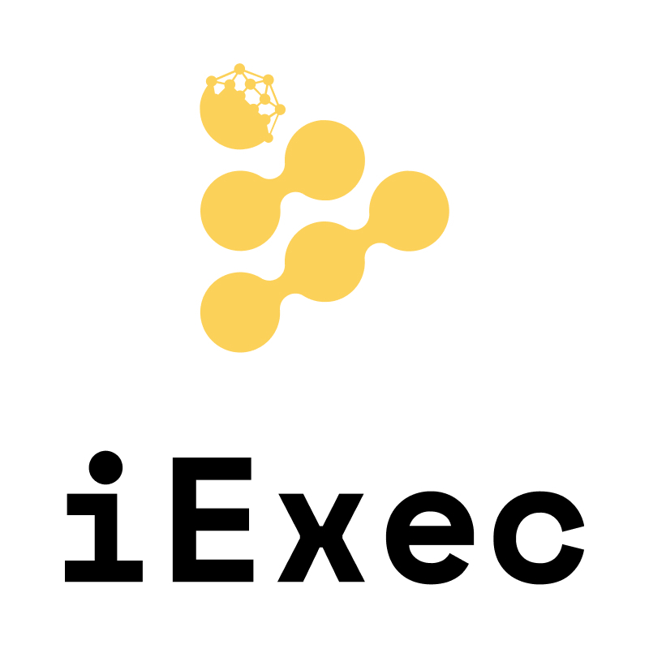

<p align="center">
  <a href="https://iex.ec/" rel="noopener" target="_blank"></a>
</p>

<h1 align="center">iApp</h1>

**iApp** offers developers methods to manage and run an iExec iApp.

<div align="center">

[](https://www.npmjs.com/package/@mage-sombre/iapp)[](/LICENSE)

</div>

## Installation

Web3mail is available as an [npm package](https://www.npmjs.com/package/@mage-sombre/iapp).

**npm:**

```sh
npm install @mage-sombre/iapp
```

**yarn:**

```sh
yarn add @mage-sombre/iapp
```

## Get started

### Browser

```ts
import { IExecIApp } from "@mage-sombre/iapp";

const web3Provider = window.ethereum;
const iapp=IExecIApp(web3Provider);
```

### NodeJS

```ts
import { IExecIApp, getWeb3Provider } from "@mage-sombre/iapp";

const { PRIVATE_KEY } = process.env; 

const web3Provider = getWeb3Provider(PRIVATE_KEY);
const iapp =IExecIApp(web3Provider);
```

## License

This project is licensed under the terms of the [Apache 2.0](/LICENSE).
